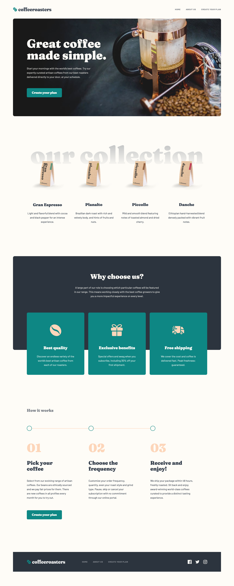

# Frontend Mentor - Coffeeroasters subscription site solution

This is a solution to the [Coffeeroasters subscription site challenge on Frontend Mentor](https://www.frontendmentor.io/challenges/coffeeroasters-subscription-site-5Fc26HVY6). Frontend Mentor challenges help you improve your coding skills by building realistic projects.

## Table of contents

- [Overview](#overview)
  - [The challenge](#the-challenge)
  - [Screenshot](#screenshot)
  - [Links](#links)
- [My process](#my-process)
  - [Built with](#built-with)
  - [Useful resources](#useful-resources)
- [Author](#author)

## Overview

### The challenge

Users should be able to:

- View the optimal layout for each page depending on their device's screen size
- See hover states for all interactive elements throughout the site
- Make selections to create a coffee subscription and see an order summary modal of their choices

### Screenshot

### Links

- Solution URL: [https://www.frontendmentor.io/solutions/mobile-first-coffeeroasters-subscription-site-2xWr7gmK2](https://www.frontendmentor.io/solutions/mobile-first-coffeeroasters-subscription-site-2xWr7gmK2)
- Live Site URL: [https://coffeeroasters-subscription-site.netlify.app/](https://coffeeroasters-subscription-site.netlify.app/)

## My process

### Built with

- Semantic HTML5 markup
- CSS custom properties
- Flexbox
- CSS Grid
- Mobile-first workflow
- [React](https://reactjs.org/)
- [React Router](https://reactrouter.com/)
- [react-modal](https://www.npmjs.com/package/react-modal)

### Useful resources

- [React Routing and Netlify Redirects](https://ridbay.medium.com/react-routing-and-netlify-redirects-fd1f00eeee95)
- [Sharing State Between Components](https://beta.reactjs.org/learn/sharing-state-between-components)
- [useOutletContext](https://reactrouter.com/docs/en/v6/api#useoutletcontext)

## Author

- Website - [Nakoya Wilson](https://nakoyawilson.netlify.app/)
- Frontend Mentor - [@nakoyawilson](https://www.frontendmentor.io/profile/nakoyawilson)
- Twitter - [@nakoyawilson](https://twitter.com/nakoyawilson)
- LinkedIn - [@nakoyawilson](https://www.linkedin.com/in/nakoyawilson/)
